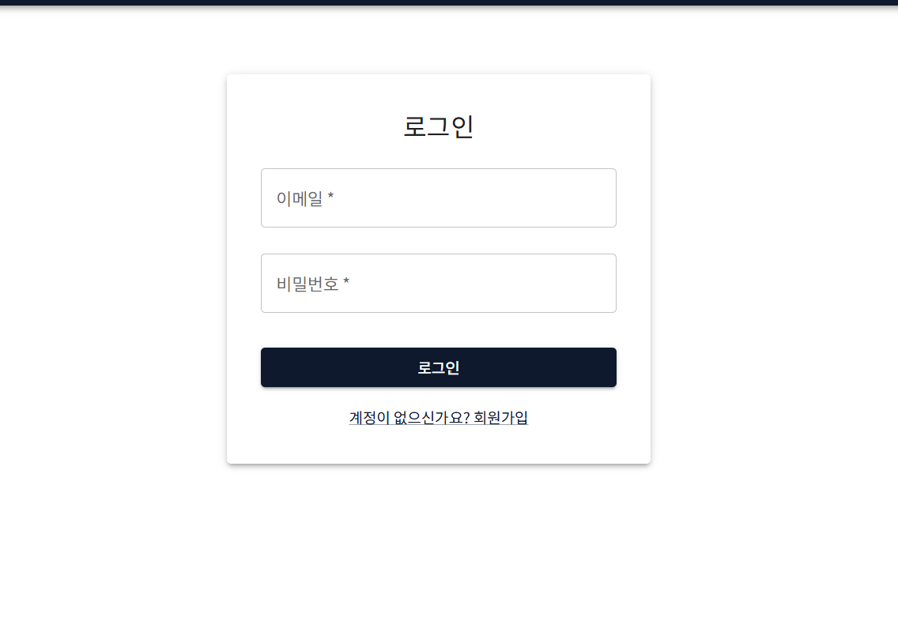

# 👨🏻‍💻PART3_5팀
---
# 📰 뉴스 API 소셜 네트워킹 서비스, MONEW

**🖱️ 팀 노션 링크**
https://bit.ly/3S0c6cX


**🖱️ 배포 웹사이트**
http://3.38.205.137:8080/

## **팀원 구성**

👤 박지현 (<a href="https://github.com/jjhparkk">https://github.com/jjhparkk</a>)<br>
👤 강병훈 (<a href="https://github.com/kbh-n">https://github.com/kbh-n</a>)<br>
👤 김승찬 (<a href="https://github.com/tmdcks801">https://github.com/tmdcks801</a>)<br>
👤 양병운 (<a href="https://github.com/Yang-ByeongUn">https://github.com/Yang-ByeongUn</a>)<br>
👤 정연경 (<a href="https://github.com/yeonkyung-jeong">https://github.com/yeonkyung-jeong</a>)

---

## **프로젝트 소개**

- 💭 여러 뉴스 API를 통합하여 사용자에게 맞춤형 뉴스를 제공하고, 의견을 나눌 수 있는 소셜 기능을 갖춘 서비스
- 🕛 프로젝트 기간: 2025.04.16 ~ 2025.05.12


🖊️ **프로젝트 내용 요약**
- **사용자 및 관심사 관리**  
  체계적인 사용자 정보 등록, 수정, 삭제 기능과  
  관심사 등록, 구독, 키워드 기반 필터링 기능 제공
- **뉴스 수집 및 조회**  
  Naver API 및 주요 언론사 RSS를 활용한 뉴스 기사 수집  
  사용자 관심사 기반 자동 분류 및 맞춤형 뉴스 제공
- **대량 뉴스 수집 처리 (Batch 시스템)**  
  뉴스 기사 수집, 알림 생성, 백업 등의 반복 작업을  
  시간 단위로 자동 수행하는 배치 시스템 구현
- **백업 자동화**  
  뉴스 기사 데이터를 날짜별로 AWS S3에 자동 백업  
  백업 데이터를 기반으로 유실된 데이터 복구 지원
- **활동 및 알림 관리**  
  댓글, 좋아요, 최근 본 기사 등 사용자 활동 이력 관리  
  관심사 기반 기사 등록 및 댓글 반응에 대한 알림 제공
- **소셜 기능 및 커뮤니티**  
  기사별 댓글 등록 및 좋아요 기능 제공  
  뉴스 기반 사용자 간 실시간 상호작용 강호
### 💡 Index
> 맞춤형 뉴스 제공 / 관심사 기반 필터링 / 안정적 배치 시스템 / 데이터 무결성 / 자동 백업 / 사용자 활동 분석

---

## **기술 스택**

- 💻 **Backend**: Spring Boot, Spring Security, Spring Data JPA
- 💽 **Database**: PostgreSQL, MongoDB
- 🌐 **Infrastructure**: AWS (EC2, RDS, S3, ECR, ECS Fargate), Docker  
- 🥫 **CI/CD Pipeline**: GitHub Actions, OIDC, Jacoco 
- 💬 **공통 Tool**: Git & Github, Discord, Code with me

---

## **팀원별 구현 기능 상세**

### **🙋🏻‍♀️ 박지현**

#### 댓글 도메인


- **댓글**
  - 댓글에 관한 API 엔드포인트 제작
  - 좋아요에 관한 API 엔드포인트 제작

### **🙋🏻‍♂️ 강병훈**

#### 관심사 도메인


- **관심사**
  - 관심사를 등록하고 그에 맞는 키워드도 등록하는 API 엔드포인트 제작
  - 관심사에 대한 정보 관리하는 API 엔드포인트 제작

### **🙋🏻‍♂️ 김승찬**

#### 유저 활동 및 알림 도메인 및 로깅


- **유저 활동**
  - 사용자의 정보 및 최근 활동을 기록하고 있는 정보를 제공하는 API 제작
- **알림**
  - 알림을 조회 및 삭제하는 API 엔드포인트 제작
  - 이벤트를 통해 알림 생성
- **로깅**
  - 로그를 MongoDB에 적재

### **🙋🏻‍♂️ 양병운**


#### 기사 도메인

- **기사**
  - 외부 API를 통해 외부의 기사 중 관심사로 등록된 기사들을 가져옴
  - 기사를 조회하는 API 엔드포인트 제작

### **🙋🏻‍♀️ 정연경**

#### 유저 도메인 및 배포 CI/CD



- **유저**
  - 유저 회원가입 로그인 기능 구현 - 로그인 성공 시, 사용자 ID를 헤더에 포함하여 API 요청하면 서버는 이로 사용자 식별 후, 쿠키 기반 세션을 통해 로그인 상태를 유지하도록 구성
  - 닉네임 수정, 논리/물리 삭제 기능 구현
- **배포**
  - Docker 이미지 빌드 후 AWS에 수동 배포 (RDS, EC2, ECR, ECS Fargate 사용)
  - 이후 Github Actions CI/CD 파이프라인 구축 후 자동 배포 성공 (AWS IAM OIDC 인증 사용)
---

## **🚗 배포 다이어그램**


---

## **📁 파일 구조**

```

src:.
+---main
|   +---java
|   |   \---com
|   |       \---example
|   |           \---part35teammonew
|   |               |   Part35teamMonewApplication.java
|   |               |
|   |               +---config
|   |               |       CorsConfig.java
|   |               |       SecurityConfig.java
|   |               |       SwaggerConfig.java
|   |               |
|   |               +---domain
|   |               |   |   ArticleInterest.java
|   |               |   |
|   |               |   +---article
|   |               |   |   +---api
|   |               |   |   |       NewsSearch.java
|   |               |   |   |
|   |               |   |   +---batch
|   |               |   |   |       ArticleSchedule.java
|   |               |   |   |       BackupBatchConfig.java
|   |               |   |   |       BatchConfig.java
|   |               |   |   |       S3BatchConfig.java
|   |               |   |   |       S3Config.java
|   |               |   |   |       S3UploadArticle.java
|   |               |   |   |       SharedArticleReader.java
|   |               |   |   |
|   |               |   |   +---controller
|   |               |   |   |   |   ArticleController.java
|   |               |   |   |   |
|   |               |   |   |   \---docs
|   |               |   |   |           ArticleApi.java
|   |               |   |   |
|   |               |   |   +---dto
|   |               |   |   |       ArticleBaseDto.java
|   |               |   |   |       ArticleCursorRequest.java
|   |               |   |   |       ArticleEnrollmentResponse.java
|   |               |   |   |       ArticleRestoreRequestDto.java
|   |               |   |   |       ArticleSourceAndDateAndInterestsRequest.java
|   |               |   |   |       ArticlesRequestDto.java
|   |               |   |   |       ArticlesResponse.java
|   |               |   |   |       findByCursorPagingResponse.java
|   |               |   |   |
|   |               |   |   +---entity
|   |               |   |   |       Article.java
|   |               |   |   |       Direction.java
|   |               |   |   |       SortField.java
|   |               |   |   |
|   |               |   |   +---repository
|   |               |   |   |       ArticleRepository.java
|   |               |   |   |
|   |               |   |   \---service
|   |               |   |           ArticleService.java
|   |               |   |           ArticleServiceImpl.java
|   |               |   |
|   |               |   +---articleView
|   |               |   |   +---Dto
|   |               |   |   |       ArticleViewDto.java
|   |               |   |   |
|   |               |   |   +---entity
|   |               |   |   |       ArticleView.java
|   |               |   |   |
|   |               |   |   +---mapper
|   |               |   |   |       ArticleViewMapper.java
|   |               |   |   |
|   |               |   |   +---repository
|   |               |   |   |       ArticleViewRepository.java
|   |               |   |   |
|   |               |   |   \---service
|   |               |   |           ArticleViewServiceImp.java
|   |               |   |           ArticleViewServiceInterface.java
|   |               |   |
|   |               |   +---comment
|   |               |   |   +---controller
|   |               |   |   |   |   CommentController.java
|   |               |   |   |   |   CommentLikeController.java
|   |               |   |   |   |
|   |               |   |   |   \---docs
|   |               |   |   |           CommentApi.java
|   |               |   |   |           CommentLikeApi.java
|   |               |   |   |
|   |               |   |   +---dto
|   |               |   |   |       CommentCreateRequest.java
|   |               |   |   |       CommentDto.java
|   |               |   |   |       CommentLikeResponse.java
|   |               |   |   |       CommentPageResponse.java
|   |               |   |   |       CommentUpdateRequest.java
|   |               |   |   |
|   |               |   |   +---entity
|   |               |   |   |       Comment.java
|   |               |   |   |       CommentLike.java
|   |               |   |   |
|   |               |   |   +---mapper
|   |               |   |   |       CommentMapper.java
|   |               |   |   |
|   |               |   |   +---repository
|   |               |   |   |       CommentLikeRepository.java
|   |               |   |   |       CommentRepository.java
|   |               |   |   |
|   |               |   |   \---service
|   |               |   |           CommentLikeService.java
|   |               |   |           CommentLikeServiceImpl.java
|   |               |   |           CommentService.java
|   |               |   |           CommentServiceImpl.java
|   |               |   |
|   |               |   +---interest
|   |               |   |   |   InterestRepository.java
|   |               |   |   |
|   |               |   |   +---controller
|   |               |   |   |   |   InterestController.java
|   |               |   |   |   |
|   |               |   |   |   \---docs
|   |               |   |   |           InterestApi.java
|   |               |   |   |
|   |               |   |   +---dto
|   |               |   |   |   +---request
|   |               |   |   |   |       InterestCreateRequest.java
|   |               |   |   |   |       InterestPageRequest.java
|   |               |   |   |   |       InterestUpdateRequest.java
|   |               |   |   |   |
|   |               |   |   |   \---response
|   |               |   |   |           InterestDto.java
|   |               |   |   |           PageResponse.java
|   |               |   |   |
|   |               |   |   +---entity
|   |               |   |   |       Interest.java
|   |               |   |   |
|   |               |   |   +---Enum
|   |               |   |   |       SortBy.java
|   |               |   |   |
|   |               |   |   \---service
|   |               |   |           InterestService.java
|   |               |   |           InterestServiceImpl.java
|   |               |   |
|   |               |   +---interestUserList
|   |               |   |   +---Dto
|   |               |   |   |       InterestUserListDto.java
|   |               |   |   |
|   |               |   |   +---entity
|   |               |   |   |       InterestUserList.java
|   |               |   |   |
|   |               |   |   +---mapper
|   |               |   |   |       InterestUserListMapper.java
|   |               |   |   |
|   |               |   |   +---repository
|   |               |   |   |       InterestUserListRepository.java
|   |               |   |   |
|   |               |   |   \---service
|   |               |   |           InterestUserListServiceImp.java
|   |               |   |           InterestUserListServiceInterface.java
|   |               |   |
|   |               |   +---notification
|   |               |   |   +---controller
|   |               |   |   |   |   NotificationController.java
|   |               |   |   |   |
|   |               |   |   |   \---docs
|   |               |   |   |           NotificationApi.java
|   |               |   |   |
|   |               |   |   +---Dto
|   |               |   |   |       CursorPageRequest.java
|   |               |   |   |       CursorPageResponse.java
|   |               |   |   |       NotificationDto.java
|   |               |   |   |
|   |               |   |   +---entity
|   |               |   |   |       Notification.java
|   |               |   |   |
|   |               |   |   +---Enum
|   |               |   |   |       NotificationType.java
|   |               |   |   |
|   |               |   |   +---repository
|   |               |   |   |       NotificationRepository.java
|   |               |   |   |
|   |               |   |   \---service
|   |               |   |           NotificationSchedulerService.java
|   |               |   |           NotificationServiceImpl.java
|   |               |   |           NotificationServiceInterface.java
|   |               |   |
|   |               |   +---user
|   |               |   |   +---controller
|   |               |   |   |       UserController.java
|   |               |   |   |
|   |               |   |   +---dto
|   |               |   |   |       TokenDto.java
|   |               |   |   |       UserDto.java
|   |               |   |   |       UserLoginRequest.java
|   |               |   |   |       UserRegisterRequest.java
|   |               |   |   |       UserUpdateRequest.java
|   |               |   |   |
|   |               |   |   +---entity
|   |               |   |   |       User.java
|   |               |   |   |
|   |               |   |   +---repository
|   |               |   |   |       UserRepository.java
|   |               |   |   |
|   |               |   |   \---service
|   |               |   |       |   UserService.java
|   |               |   |       |
|   |               |   |       \---impl
|   |               |   |               CustomUserDetails.java
|   |               |   |               CustomUserDetailsService.java
|   |               |   |               UserServiceImpl.java
|   |               |   |
|   |               |   \---userActivity
|   |               |       +---controller
|   |               |       |   |   UserActivityController.java
|   |               |       |   |
|   |               |       |   \---docs
|   |               |       |           UserActivityApi.java
|   |               |       |
|   |               |       +---Dto
|   |               |       |       ArticleInfoView.java
|   |               |       |       InterestView.java
|   |               |       |       LikeCommentView.java
|   |               |       |       RecentCommentView.java
|   |               |       |       UserActivityDto.java
|   |               |       |       UserInfoDto.java
|   |               |       |
|   |               |       +---entity
|   |               |       |       UserActivity.java
|   |               |       |
|   |               |       +---maper
|   |               |       |       ArticleInfoViewMapper.java
|   |               |       |       InterestViewMapper.java
|   |               |       |       LikeCommentMapper.java
|   |               |       |       RecentCommentMapper.java
|   |               |       |       UserActivityMapper.java
|   |               |       |
|   |               |       +---repository
|   |               |       |       UserActivityRepository.java
|   |               |       |
|   |               |       \---service
|   |               |               UserActivityServiceImpl.java
|   |               |               UserActivityServiceInterface.java
|   |               |
|   |               +---exeception
|   |               |   |   ErrorCode.java
|   |               |   |   ErrorResponse.java
|   |               |   |   GlobalExceptionHandler.java
|   |               |   |   RestApiException.java
|   |               |   |
|   |               |   +---comment
|   |               |   |       CommentDeleteUnauthorized.java
|   |               |   |       CommentLikeConflict.java
|   |               |   |       CommentLikeNotFound.java
|   |               |   |       CommentNotFound.java
|   |               |   |       CommentUpdateUnauthorized.java
|   |               |   |
|   |               |   +---errorcode
|   |               |   |       ArticleErrorCode.java
|   |               |   |       ArticleViewErrorCode.java
|   |               |   |       CommentErrorCode.java
|   |               |   |       GlobalErrorCode.java
|   |               |   |       InterestErrorCode.java
|   |               |   |       InterestUserListErrorCode.java
|   |               |   |       NotificationErrorCode.java
|   |               |   |       UserActivityErrorCode.java
|   |               |   |
|   |               |   +---notification
|   |               |   |       WrongUserNotification.java
|   |               |   |
|   |               |   \---userActivity
|   |               |           UserActivityErrorUpdate.java
|   |               |           UserActivityNotFoundException.java
|   |               |
|   |               +---health
|   |               |       HealthCheckController.java
|   |               |
|   |               +---log
|   |               |       MongoDBAppender.java
|   |               |
|   |               \---util
|   |                       SecurityUtil.java
|   |
|   \---resources
|       |
|       \---static
|           |   favicon.ico
|           |   index.html
|           |
|           \---assets
|                   index-D30UMZL2.css
|                   index-DF13B-h9.js
|
\---test
    |
    \---java
        \---com
            \---example
                \---part35teammonew
                    │   Part35teamMonewApplicationTests.java
                    │
                    ├── config
                    │   └── TestJpaConfig.java
                    │
                    ├── domain
                    │   ├── article
                    │   │   ├── api
                    │   │   │   └── NewsSearchTest.java
                    │   │   ├── batch
                    │   │   │   └── ArticleScheduleTest.java
                    │   │   ├── repository
                    │   │   │   └── ArticleRepositoryTest.java
                    │   │   └── service
                    │   │       └── ArticleServiceImplTest.java
                    │   ├── articleView***
                    │   ├── comment***
                    │   ├── interest***
                    │   ├── interestUserList***
                    │   ├── notification***
                    │   ├── user***
                    │   └── userActivity***
                    │
                    └── sprint
                        └── mission
                            └── monew_
                                └── MonewApplicationTests.java

```

